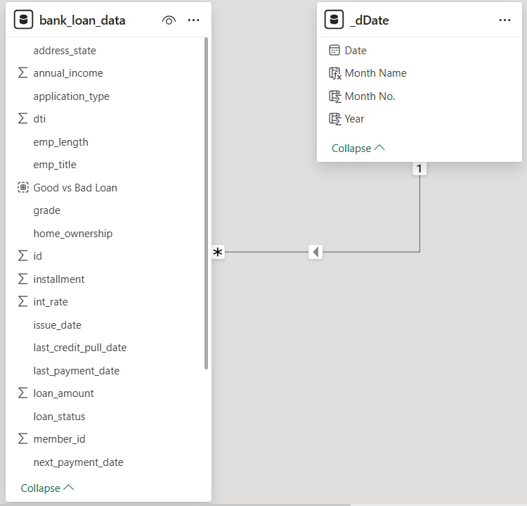
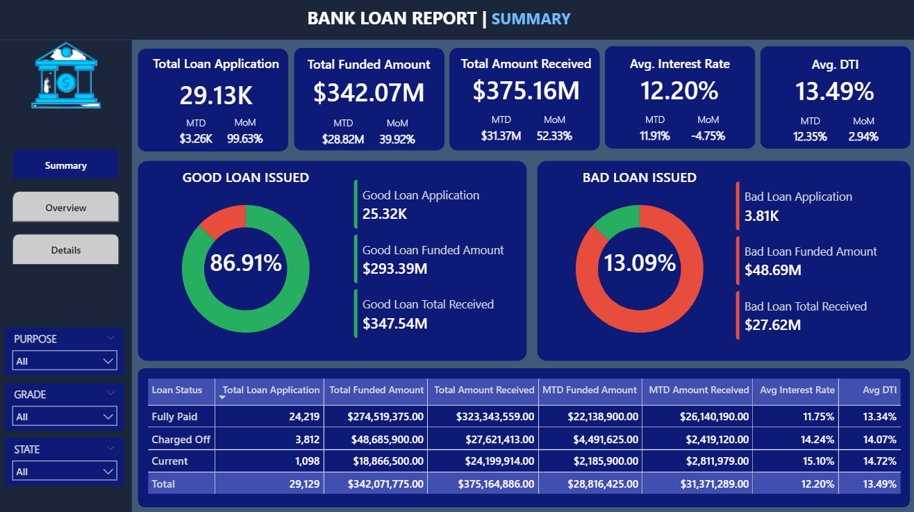
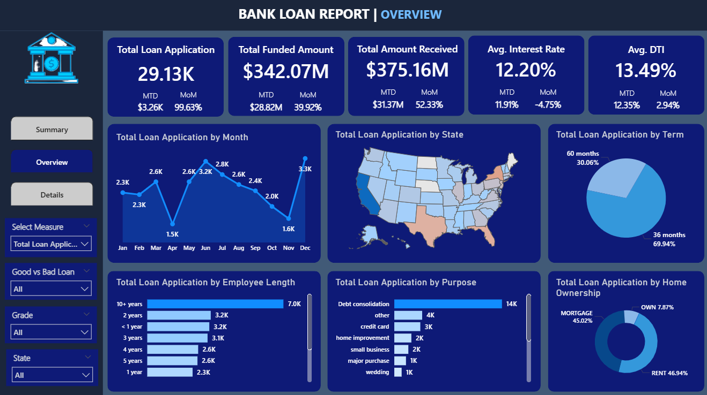
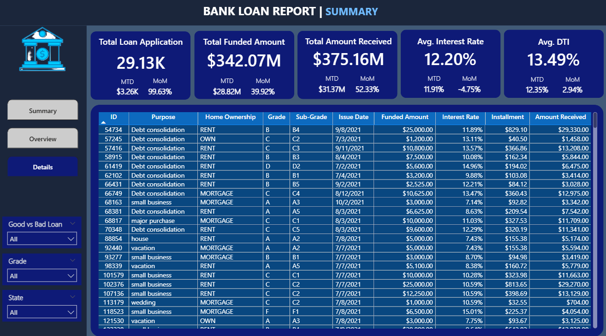
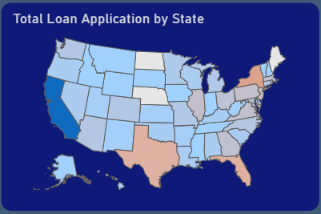
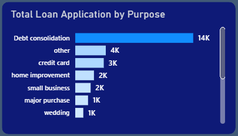
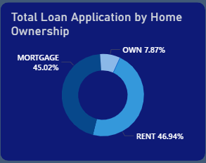
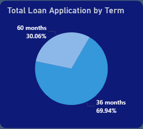

# Project Background & Overview
Lending is the core revenue driver for banks, but it is also the primary source of risk. This project analyzes a comprehensive loan dataset to monitor the health of the lending portfolio. By evaluating loan applications, funded amounts, and repayment patterns, the bank can identify "Good" vs. "Bad" loans, track seasonal trends, and adjust lending policies to ensure long-term profitability.

**Key Business Questions:**
* What is the total funded amount versus the total amount received back from borrowers?
* What percentage of our loans are "Bad Loans" (Charged Off), and how does this impact our bottom line?
* Are there specific months where loan applications spike or where repayment rates drop?
* How do factors like home ownership, employment length, and loan purpose (e.g., debt consolidation, home improvement) affect loan stability?

# Data Structure Overview
The data tracks the lifecycle of each loan from application to final repayment.

* **Source:** Kaggle Public Dataset
* **Loan Details:** ID, Loan Amount, Funded Amount, Interest Rate, and Installment.
* **Borrower Profile:** Employment Length, Home Ownership (Mortgage, Rent, Own), and Debt-to-Income (DTI) ratio.
* **Performance Metrics:**Loan Status (Fully Paid, Current, Charged Off), Total Payment Received, and Issue Date.
  
**Entity Relationship Diagram (ERD):**

# Executive Summary
The bank has processed a high volume of applications, with a clear distinction between profitable and high-risk segments. While the majority of the portfolio consists of **"Good Loans"** (Fully Paid and Current), there is a significant **"Bad Loan"** segment that requires immediate attention. Monthly trends show steady growth in applications, but the **Average DTI (Debt-to-Income)** indicates that many borrowers are heavily leveraged, which could lead to future defaults.

**High-Level Metrics**
* **Total Loan Applications**: 29.13K
* **Total Funded Amount**: $342.07M
* **Total Amount Received**: $375.16M
* **Average Interest Rate**: 12.20%
* **Average DTI Ratio**: 13.49%
* **Good Loan %**: 86.91%
* **Bad Loan %**: 13.09%
  
**Summary**

**Overview**

**Details**

# Insights Deep Dive
### Regional Hotspots & Lending Gaps
* Certain states show significantly higher application volumes and funded amounts than others.
* High-volume regions often correlate with lower interest rates but higher total received amounts. Identifying "Cold" regions allows for targeted marketing to expand the portfolio.

### Loan Purpose: Debt Consolidation Dominance
  * "Debt Consolidation" is typically the #1 reason for loan applications, often carrying higher average loan amounts.
  * Borrowers using loans to pay off other debts represent a "revolving risk." While they are a large customer segment, their DTI ratios must be monitored closely to prevent "Bad Loan" spikes.
    

### The Impact of Home Ownership on Risk
* Borrowers with a **Mortgage** or those who **Rent** make up the largest percentage of applications, while "Owners" are a much smaller segment.
* Renters often have a slightly higher default rate. Homeowners (with mortgages) tend to be more stable, likely due to having more to lose (collateral) and better credit histories.
  

### Term Analysis: 36 vs. 60 Months
* Short-term loans (36 months) are more popular, but long-term loans (60 months) generate higher interest income.
* Long-term loans carry a higher risk of turning into "Bad Loans" as the borrower's financial situation is more likely to change over 5 years compared to 3 years.

# Recommendations
* **Tighten Credit for High DTI**: For applicants with a DTI above **15%**, consider implementing stricter income verification or slightly higher interest rates to offset the risk.
* **Incentivize "Good" Borrowers**: Offer lower interest rates or "Top-up" loan options to borrowers in the **"Fully Paid"** category to encourage repeat business with low-risk customers.
* **Address the 13.9% Bad Loan Rate**: Investigate the specific **Loan Purposes** and **Employment Lengths** associated with "Charged Off" status. If 1-year employees are defaulting more, increase the minimum employment requirement.
* **Seasonal Campaigns**: Since application volumes fluctuate monthly, launch **"Low Interest"** promotions during slow months to maintain steady cash flow and staff utilization.
